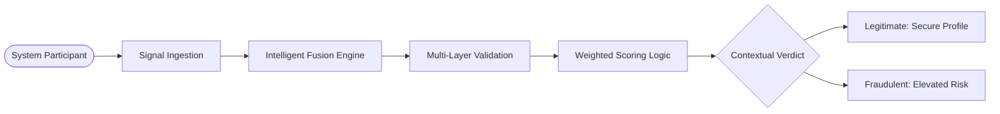
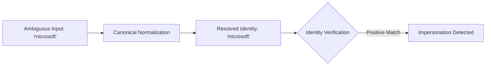
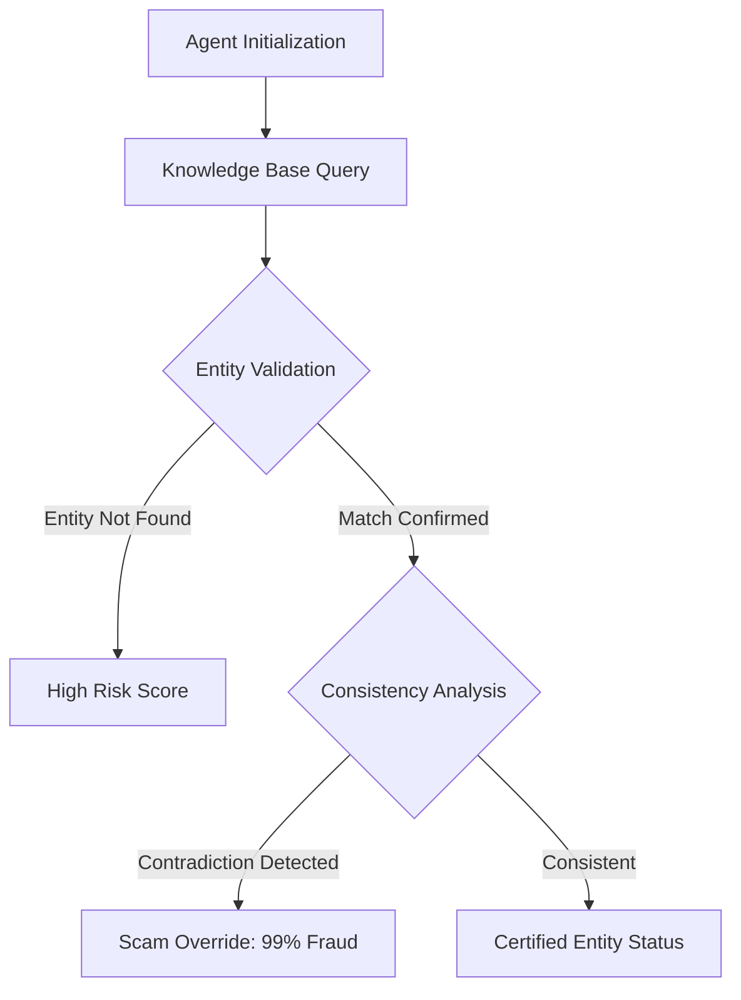

# VeriIntern AI: Advanced Internship Fraud Detection System

## Executive Summary
VeriIntern AI is a sophisticated cybersecurity framework engineered to mitigate the rising threat of internship-related financial fraud and identity theft. By implementing a multi-layered Intelligent Fusion Engine, the system performs real-time validation of internship offers through semantic analysis, identity verification, and autonomous web-intelligence research. The platform serves as a critical defensive layer for academic and professional institutions, ensuring the integrity of student career opportunities.

---

## Architectural Framework

### System Interaction Workflow
The following diagram illustrates the formal process from initial signal ingestion to the delivery of the contextual verdict.



---

## The Four-Layer Verification Pipeline

The system employs a defense-in-depth strategy, analyzing each internship offer through four distinct computational layers to ensure maximum detection precision.

### 1. Semantic Signal Analysis
The engine utilizes natural language processing (NLP) to identify high-risk linguistic patterns. It employs a negation-aware keyword detection system that distinguishes between legitimate process descriptions and fraudulent monetary demands.

### 2. Digital Identity Verification
This layer focuses on detecting sophisticated impersonation tactics. The system maintains a curated database of verified global organizations and utilizes a custom normalization algorithm to identify visual deception.

#### Homoglyph Deception Guard
Fraudulent actors often use visually similar characters (Homoglyphs) to mimic reputable corporations. VeriIntern AI neutralizes this through a canonical normalization process.



### 3. Network Infrastructure Analysis
Automated validation of URL endpoints included in internship offers. The system evaluates domain age, Top-Level Domain (TLD) reputation, and real-time server responsiveness to identify phishing infrastructure.

### 4. Autonomous Web-Intelligence Agent
The system deploys an autonomous research agent that queries global knowledge bases (e.g., Wikipedia) to verify the legal and corporate existence of the claiming entity.



---

## Weighted Fusion Engine Logic

Final verdicts are calculated using a sophisticated weighting algorithm that prioritizes external web-intelligence and verified identity records over self-contained text signals.

| Analytical Component | Weighting | Functional Purpose |
|:--- |:--- |:--- |
| **Autonomous Web Agent** | 55% | Validates corporate footprint and global presence. |
| **Identity Verification** | 25% | Detects impersonation and homoglyph visual tricks. |
| **Semantic Analysis** | 20% | Identifies linguistic red flags and payment demands. |

---

## Technical Specifications

### Core Technologies
- **Backend Architecture**: Python 3.10+ / Flask Micro-framework
- **Analysis Engine**: Natural Language Processing (NLP) / Multi-weighted Fusion Logic
- **Intelligence Integrations**: MediaWiki API Integration
- **Frontend Interface**: Advanced CSS3 / Dynamic JavaScript Rendering

### Project Structure
```text
VeriIntern-AI/
├── app.py                     # Core API and Scoring Orchestration
├── utils/
│   ├── company_check.py       # Identity Verification and Normalization
│   ├── url_check.py           # Network Infrastructure Analysis
│   └── scraping_agent.py      # Autonomous Web Research Logic
├── static/
│   ├── style.css              # System UI Design Patterns
│   └── script.js              # Result Orchestration and Rendering
├── templates/
│   └── index.html             # System Dashboard
└── test_scoring.py            # Automated Validation Suite
```

---

## Deployment and Execution

### Prerequisites
- Python 3.10 or higher
- Pip package manager

### Installation Procedure
1. Initialize the environment:
   ```bash
   python -m venv venv
   source venv/bin/activate  # venv\Scripts\activate on Windows
   ```
2. Install dependencies:
   ```bash
   pip install -r requirements.txt
   ```
3. Execute the application:
   ```bash
   python app.py
   ```

---

## Project Governance and Leadership
The development and architectural design of VeriIntern AI were spearheaded by the following team members:

- **Mano Shruthi S**
- **Bala Sowndarya B**
- **Kowsalya V**
- **Kaviya Varshini S**

---
VeriIntern AI - Cybersecurity Research and Development
