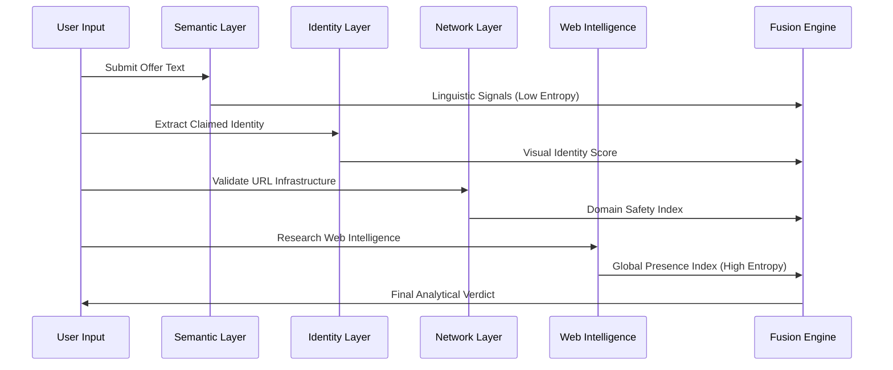

# VeriIntern AI: Technical & Theoretical Specification

## Abstract
VeriIntern AI is a multi-layered analytical framework designed to identify and neutralize fraudulent internship solicitations. By implementing an **Intelligent Fusion Engine**, the system cross-references semantic text signals, digital identity markers, and global knowledge-base records. This architecture ensures a prioritized verification process that prioritizes "Ground Truth" intelligence over self-contained linguistic patterns, effectively mitigating the threat of internship-related cyber-fraud.

---

## Architectural Theory

### 1. Multi-Dimensional Defense-in-Depth
The system operates on an isolating layered model where each computational layer performs a specific validation specialized in a single data dimension. This prevents a single failure point—such as a convincing but fake company name—from compromising the entire verdict.



### 2. Weighted Information Fusion Logic
VeriIntern AI utilizes a prioritized weighting system. We acknowledge that text-based signals (e.g., "Registration Fee") are informative but easily manipulated by scammers. Therefore, the system assigns the highest weight (55%) to **External Knowledge Verification**, ensuring that an organization's global footprint is the primary driver of legitimacy.

---

## Technological Stack Evaluation

Each tool in our stack was selected based on technical performance, library ecosystem, and security requirements:

- **Python 3.10+**: Selected for its robust support for Regular Expressions (re), high-level data manipulation, and the ability to handle complex conditional scoring logic efficiently.
- **Flask (Micro-framework)**: Chosen for its lightweight overhead and "modular routing" capabilities, allowing for near-instant JSON delivery between the backend analytics and frontend rendering.
- **MediaWiki Global API**: Utilized to facilitate real-time queries against the world's most comprehensive open knowledge base. This allows the system to acquire "Ground Truth" data dynamically without the need for pre-indexing billions of entities.
- **Vanilla CSS3 & ES6 JavaScript**: Implemented for a zero-dependency, high-performance analytical dashboard that ensures rapid data updates and sophisticated visual state management.

---

## Core Security Frameworks

### I. Homoglyph Visual Normalization
Attackers exploit human foveal vision by using visually similar characters (Homoglyphs) to mimic reputable entities. VeriIntern AI neutralizes this through a **Canonical Normalization Engine** that resolves ambiguous characters to their Latin canonical form before performing database comparisons.

### II. Contextual Contradiction Engine
Beyond simple keyword matching, the system identifies **Semantic Paradoxes**. If a verified global organization (e.g., "Google") is found in the same context as a "Registration Fee" demand, the system triggers a **Scam Override**, as these two signals are mathematically and operationally inconsistent in legitimate recruitment.

---

## Exhaustive Project Structure

VeriIntern AI is engineered with a strict modular hierarchy to ensure maintainability and security isolation:

```text
VeriIntern-AI/
├── .gitignore                # Git Configuration: Defines system exclusion rules
├── app.py                    # Analytical Orchestrator: Core API and Fusion Logic
├── Readme.md                 # Technical Specification: System documentation
├── requirements.txt          # Dependency Manifest: List of requisite libraries
├── test_scoring.py           # Verification Suite: Automated logic validation scripts
│
├── utils/                    # Theoretical Core: Specialized analysis modules
│   ├── __init__.py           # Package Descriptor: Defines the directory as a module
│   ├── company_check.py      # Identity Engine: Implements Homoglyph normalization
│   ├── scraping_agent.py     # Intelligence Agent: Wikipedia research logic
│   └── url_check.py          # Network Logic: URL infrastructure analysis
│
├── templates/                # Presentation Layer: Structural layout
│   └── index.html            # Analytical Dashboard: System interface
│
└── static/                   # Asset Management: Visual and logical assets
    ├── favicon.svg           # Identity Asset: System brand mark
    ├── script.js             # Client Logic: UI orchestration and API bridging
    └── style.css             # Visual Directives: Premium design patterns
```

---

## Deployment & Implementation Guide

### Prerequisites
- Python 3.10 or higher
- Pip Package Manager

### System Initialization
1.  **Environment Preparation**:
    ```bash
    python -m venv venv
    source venv/bin/activate  # venv\Scripts\activate on Windows
    ```
2.  **Library Installation**:
    ```bash
    pip install -r requirements.txt
    ```
3.  **Engine Execution**:
    ```bash
    python app.py
    ```

---

## Project Leadership & Governance

The technical architecture and development of VeriIntern AI are spearheaded by:

- **Mano Shruthi S**
- **Bala Sowndarya B**
- **Kowsalya V**
- **Kaviya Varshini S**

---
VeriIntern AI - Cybersecurity Research and Advanced Development
