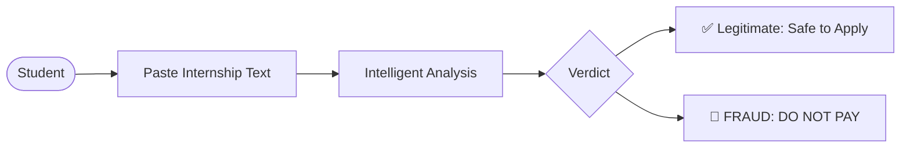
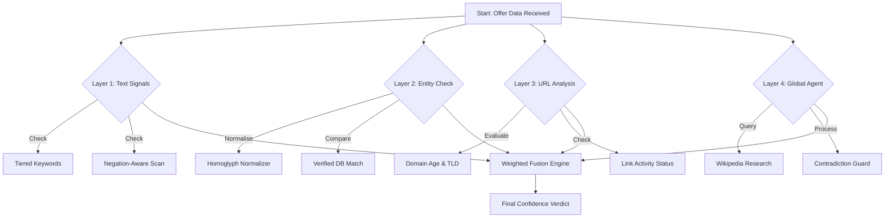
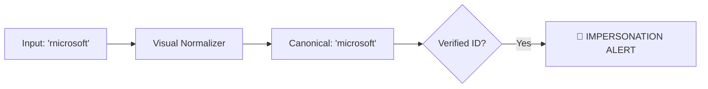
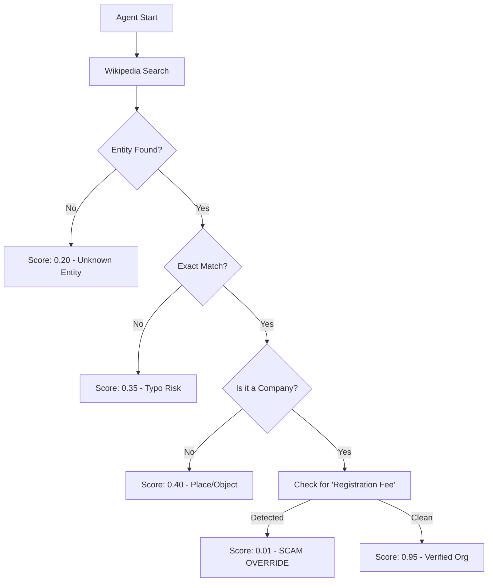

# 🛡️ VeriIntern AI — Internship Fraud Detection System

<p align="center">
  
  
  
  
</p>

---

## 📌 Project Overview
**VeriIntern AI** is a professional-grade cybersecurity tool designed to protect students from sophisticated internship fraud. Using a multi-layered **Intelligent Fusion Engine**, it analyzes offer text, verifies company identities, and cross-references global knowledge bases to identify scams with high precision.

---

## 🏗️ System Architecture & Flow

### 1. High-Level User Journey
How a student interacts with the system:



### 2. The 4-Layer Verification Pipeline
Our "Defense-in-Depth" strategy for analyzing every internship offer:



---

## 🔬 Core Technologies & Logic

### 1️⃣ Homoglyph Impersonation Guard
We detect "visual typos" that human eyes often miss but scammers use to mimic giants like Google or Microsoft.



| Type | Fake | Detected As |
|------|------|-------------|
| **rn → m** | `rnicrosoft` | **microsoft** |
| **0 → o** | `g00gle` | **google** |
| **vv → w** | `vvipro` | **wipro** |

### 2️⃣ Weighted Fusion Engine
Scores are combined using a dynamic weighting system that prioritizes **Global Presence (Web Agent)** over simple text matching.

| Component | Weight | Purpose |
|-----------|--------|---------|
| **Web Agent** | **55%** | Verifies global entity footprint. |
| **Company Check** | **25%** | Detects name trickery/impersonation. |
| **Text Analysis** | **20%** | Analyzes language and payment red flags. |

> [!IMPORTANT]
> **Scam Override**: If the "Global Agent" detects a "Registration Fee" demand, the fraud score is automatically forced to **99%**, even if the company name looks real.

---

## 🤖 Web Research Agent Logic
The agent doesn't just look for "real" entities—it checks for **Contextual Consistency**.



---

## 📁 Project Structure

```text
VeriIntern-AI/
├── app.py                 # Core API & Fusion Scoring Engine
├── utils/
│   ├── company_check.py   # Homoglyph & Database Logic
│   ├── url_check.py       # Phishing Detection Logic
│   └── scraping_agent.py  # Wikipedia Research Agent
├── static/
│   ├── style.css          # Premium Dark Theme Styles
│   └── script.js          # Result Rendering & Auto-Detection
├── templates/
│   └── index.html         # User Dashboard UI
└── test_scoring.py        # Automated Test Suite
```

---

## 🚀 Installation & Usage

1.  **Clone Repository**:
    ```bash
    git clone https://github.com/manoshruthis/VeriIntern-AI.git
    ```
2.  **Activate Environment**:
    ```bash
    python -m venv venv
    venv\Scripts\activate
    ```
3.  **Install & Run**:
    ```bash
    pip install -r requirements.txt
    python app.py
    ```

---

<p align="center">
  Developed with focus on Student Safety<br/>
  <strong>Team VeriIntern</strong>
</p>
