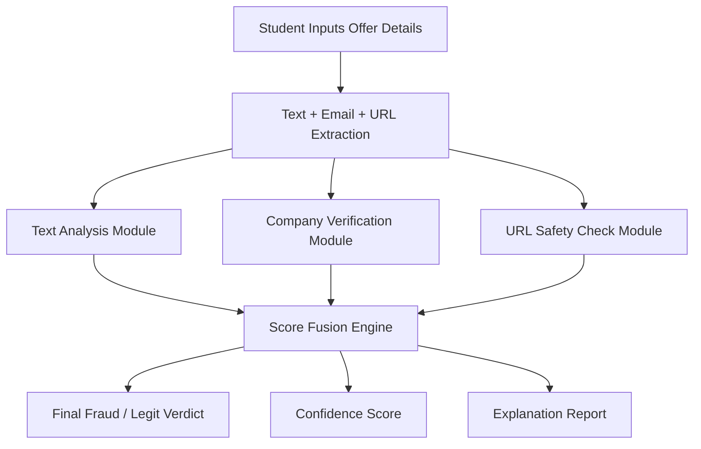
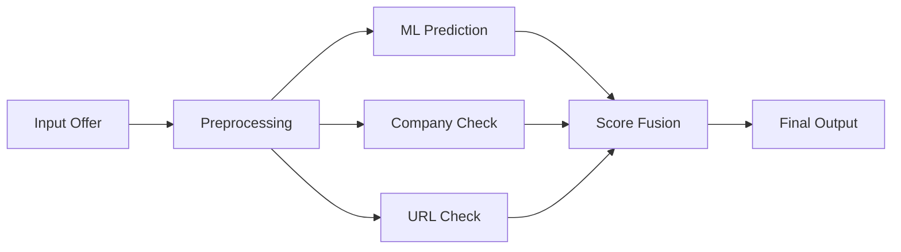

# VeriIntern-AI 🚀

### Intelligent Fraud Detection System for Internship Offers

---

## 📌 Overview

**VeriIntern-AI** is a smart AI-driven system designed to detect fraudulent internship offers by combining **text analysis, company verification, and URL validation**.

Unlike basic ML models, this system uses a **multi-layer verification approach** to improve accuracy and reliability while remaining fully implementable using **free tools and APIs**.

---

## ❗ Problem Statement

Students frequently encounter fraudulent internship offers that involve:

* Payment requests
* Fake company identities
* Suspicious or phishing links

Traditional detection methods rely only on text analysis, which is often insufficient.

There is a need for a **comprehensive system** that verifies internship offers using multiple signals such as content, company authenticity, and domain credibility.

---

## 🎯 Objective

* Build a **multi-source fraud detection system**
* Combine ML predictions with external verification checks
* Provide **clear decision + explanation**
* Ensure the system works using **free and accessible tools**
* Deliver a fully working prototype within **15 days**

---

## 🧠 System Architecture

---

## ⚙️ Core Components

### 1. 🔍 Text Analysis (ML/NLP)

* TF-IDF Vectorization
* Logistic Regression / Naive Bayes
* Detects scam patterns like:

  * “Pay registration fee”
  * “No interview required”
  * Unrealistic salary

---

### 2. 🏢 Company Verification (Free Approach)

* Basic company validation using:

  * Manual dataset of known companies
  * Domain existence check
  * WHOIS lookup (free libraries/APIs)

---

### 3. 🌐 URL Safety Check

* Check:

  * Suspicious domains
  * URL patterns
  * Domain age (via WHOIS)

---

### 4. 🧮 Smart Score Fusion

Combine multiple signals:

| Component     | Weight |
| ------------- | ------ |
| ML Model      | 50%    |
| Company Check | 25%    |
| URL Check     | 25%    |

Final decision is based on combined score.

---

## 🚀 Features

* Multi-layer fraud detection
* AI-based text classification
* Company legitimacy verification
* URL safety analysis
* Confidence score output
* Explanation of prediction

---

## 🧰 Tech Stack (100% Free Tools)

| Layer        | Technology            |
| ------------ | --------------------- |
| Language     | Python                |
| ML/NLP       | Scikit-learn          |
| Data         | Pandas, NumPy         |
| Backend      | Flask                 |
| Frontend     | HTML, CSS, JavaScript |
| Domain Check | Python WHOIS          |
| Deployment   | Local / Free hosting  |

---

## 📊 Workflow

---

## 📈 Expected Output

| Output Type      | Description          |
| ---------------- | -------------------- |
| Prediction       | Fraud / Legit        |
| Confidence Score | 0–100%               |
| Explanation      | Why it is flagged    |
| Company Status   | Verified / Not Found |

---

## 🧪 Project Scope (15-Day Plan)

| Phase              | Duration |
| ------------------ | -------- |
| Dataset Collection | 2 days   |
| ML Model           | 4 days   |
| Verification Logic | 3 days   |
| Backend (Flask)    | 3 days   |
| Frontend UI        | 2 days   |
| Testing & Fixing   | 1 day    |

---

## 💡 Future Enhancements

* Integration with real-time APIs
* Deep Learning (BERT)
* Browser extension for job sites
* Email scam detection

---

## 👩‍💻 Team Members

* Mano Shruthi S
* Bala Sowndarya
* Kowsalya V
* Kaviya Varshini S

---

## 📌 Project Status

🟡 Planning & Design Phase

---

## 🏁 Conclusion

VeriIntern-AI proposes a practical and scalable solution for detecting fraudulent internship offers by combining AI with real-world verification techniques.

This approach enhances accuracy, reliability, and trust—making it a valuable tool for students navigating online career opportunities.

---