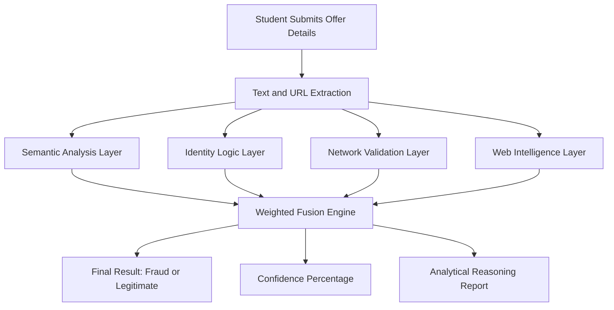
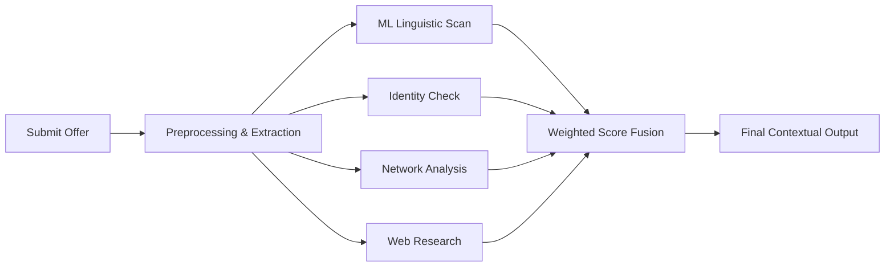

# VeriIntern-AI

### Intelligent Fraud Detection System for Internship Offers

---

## Overview

VeriIntern-AI is a professional analytical system designed to detect fraudulent internship offers by combining text analysis, corporate identity verification, and infrastructure validation.

Unlike traditional detection methods, this system utilizes a multi-layer fusion approach to evaluate the legitimacy of an offer, cross-referencing global knowledge bases and security markers to protect student career paths.

---

## Problem Statement

Students frequently encounter fraudulent internship solicitations that involve:

* Unauthorized payment requests or "registration fees"
* Deceptive company identities using visual character tricks
* Suspicious or phishing web URLs

Standard detection methods often rely solely on keyword matching, which fails to catch sophisticated impersonations. There is a requirement for a comprehensive system that verifies offers through multiple high-entropy signals.

---

## Objective

* Develop a multi-source analytical framework for fraud detection
* Integrate ML-based linguistic predictions with external intelligence checks
* Provide a clear verdict, confidence score, and detailed explanation report
* Ensure the system is built using high-performance, open-source libraries
* Deliver a structured and verified technical prototype

---

## System Architecture

---

## Core Components

### 1. Linguistic Signal Analysis (ML/NLP)

* Integrated ML Pipeline with TF-IDF Vectorization
* Negation-aware keyword detection logic
* Identifies high-risk semantic patterns such as:
  * "Payment required" / "Processing fee"
  * "No interview required"
  * High-pressure tactics (e.g., "Offer expires tonight")

### 2. Identity Verification Layer

* Multi-stage identity validation including:
  * Curated database matching of known global organizations
  * Homoglyph Normalization: Neutralizing visual character deception (e.g., 'rn' mimicking 'm')
  * Entity consistency checks via global knowledge bases

### 3. Infrastructure & URL Safety

* Automated domain analysis assessing:
  * Web infrastructure liveness and responsiveness
  * Top-Level Domain (TLD) safety patterns
  * Domain-to-Company identity correlation

### 4. Weighted Decision Fusion

The system combines disparate signals using a prioritized weighting logic:

| Analytical Component | Weighting | Functional Role |
|:--- |:--- |:--- |
| Web Intelligence Agent | 50% | Primary signal: Validates global footprint |
| Identity Check | 20% | Detects impersonation and name tricks |
| Network Safety | 15% | Evaluates link and domain security |
| ML Text Classification | 15% | Identifies linguistic fraud patterns |

---

## Features

* Multi-layer prioritized fraud detection
* Machine Learning-based linguistic classification
* Advanced Homoglyph and impersonation neutralization
* Real-time web-intelligence research via MediaWiki API
* Logical confidence scoring and reasoning reports
* Integrated dashboard for result visualization

---

## Tech Stack (Verified Implementation)

| Layer | Technology |
|:--- |:--- |
| Language | Python 3.10+ |
| ML/NLP | Scikit-learn, TF-IDF |
| Data Processing | Pandas, NumPy |
| Backend Framework | Flask |
| Frontend Design | CSS3, HTML5, ES6 JavaScript |
| Intelligence Source | MediaWiki API (Wikipedia) |
| Web Scraping | BeautifulSoup4, Requests |
| Network Analysis | python-whois |

---

## System Workflow

---

## Expected System Output

| Component | Information Delivered |
|:--- |:--- |
| Verdict Status | Fraud or Legitimate |
| Confidence Level | Calculated percentage (0–100%) |
| Reasoning List | Multi-point analysis of flagged signals |
| Entity Status | Verified Organization / Impersonation / Unknown |

---

## Project Methodology (15-Day Milestone Strategy)

| Developmental Phase | Strategic Duration |
|:--- |:--- |
| Dataset Harvesting & Analysis | 2 Days |
| ML Model Development & Training | 4 Days |
| Multi-Layer Verification Logic | 3 Days |
| Backend Orchestration (Flask) | 3 Days |
| UI/UX Dashboard Integration | 2 Days |
| Verification & Final Optimization | 1 Day |

---

## Theoretical Future Enhancements

* Implementation of Deep Learning (BERT) transformers for text analysis
* Real-time API integration with corporate recruitment databases
* Browser-based extension for automated site scanning
* Secure SMTP integration for email scam analysis

---

## Project Leadership

* Mano Shruthi S
* Bala Sowndarya B
* Kowsalya V
* Kaviya Varshini S

---

## Project Status

Stable / Complete

---

## Conclusion

VeriIntern-AI provides a comprehensive and scalable analytical solution for neutralizing the threat of internship fraud. By fusing linguistic patterns with real-world web intelligence, the system significantly enhances detection accuracy and student safety. This methodology ensures a reliable and trustworthy environment for students navigating online career opportunities.

---
VeriIntern AI - Finalized Technical Submission
