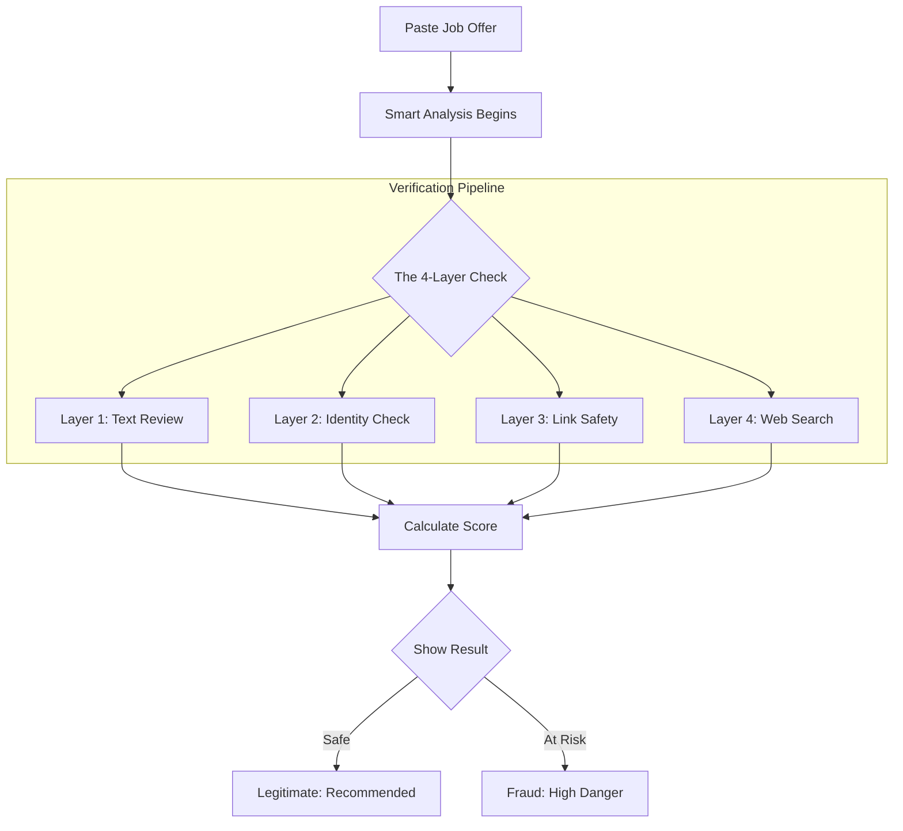
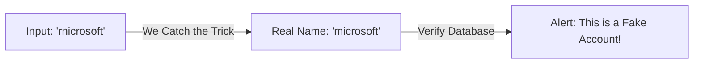
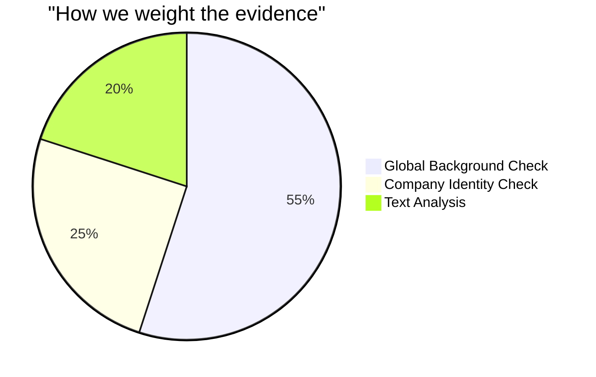

# VeriIntern AI: The Smart Internship Guard

## Project Overview
VeriIntern AI is a professional tool built to protect students from internship scams. It uses advanced technology to scan job offers, check company names, and verify website links. By combining several layers of smart analysis, it helps you know if an internship is a real career opportunity or a dangerous fraud.

---

## How it Works
The system follows a simple but powerful path to verify every offer you submit.



---

## Our Smart Detection Layers

We don't just look for "scam words." We use a multi-stage approach to find the truth behind every message.

### 1. Smart Text Review
Our system reads the internship text to find hidden "red flags." It understands context—for example, it knows that "No registration fee" is a good sign, while "Pay registration fee" is a warning.

### 2. Name Trick Detection (Identity Check)
Scammers often use "visual tricks" to pretend they are from big companies like Google or Microsoft. They might use a zero (0) instead of an 'o', or 'rn' instead of an 'm'. 

**Example of how we catch these tricks:**



| Visual Trick | What it Looks Like | Real Identity |
|:--- |:--- |:--- |
| Character Change | rnicrosoft | **microsoft** |
| Number Swap | g00gle | **google** |
| Symbol Trick | micro$oft | **microsoft** |

### 3. Website & Link Safety
The system checks every link to see if it is live and if the website name actually belongs to the company. It looks for "phishing" signs that a normal person might miss.

### 4. Global Background Checker
Our "Web Agent" acts like a digital researcher. It searches trusted global databases (like Wikipedia) to see if the company exists and if they have a history of offering internships.

---

## The Scoring Logic (Simplified)
The system combines the results from all layers. Some layers are more important than others because they are harder to fake.



- **Global Presence (55%)**: If the company isn't found in global records, it's a major red flag.
- **Identity (25%)**: Catching name tricks is a strong indicator of fraud.
- **Text Patterns (20%)**: Checking for "pay now" phrases completes the analysis.

---

## Exhaustive Project Structure

VeriIntern AI is organized into a modular architecture. Below is the complete list of files included in this repository:

```text
VeriIntern-AI/
├── .gitignore                # Git Configuration: Specifies files to ignore
├── app.py                    # Main Server: Orchestrates the scoring engine and API
├── Readme.md                 # Documentation: Comprehensive project guide
├── requirements.txt          # Dependencies: List of required Python libraries
├── test_scoring.py           # Testing: Automated scripts to verify analysis
│
├── utils/                    # Logic Core: Specialized analysis modules
│   ├── __init__.py           # Package Init: Marks the directory as a Python package
│   ├── company_check.py      # Identity Engine: Catching name tricks
│   ├── scraping_agent.py     # Web Intelligence: Wikipedia research agent
│   └── url_check.py          # Link Analysis: Checking URL safety
│
├── templates/                # Layout: Dashboard structure
│   └── index.html            # User Interface: The HTML application dashboard
│
└── static/                   # Assets: Design and interactivity
    ├── favicon.svg           # Icon: System brand mark
    ├── script.js             # Interactivity: UI logic and API communication
    └── style.css             # Visuals: Professional dark-themed design
```

---

## How to Run the Project

### Prerequisites
- Python 3.10 installed on your computer.

### Setup Steps
1. **Prepare the environment**:
   ```bash
   python -m venv venv
   source venv/bin/activate
   ```
2. **Install requirements**:
   ```bash
   pip install -r requirements.txt
   ```
3. **Start the system**:
   ```bash
   python app.py
   ```

---

## Project Team
This project was designed and developed by the following team members:

- **Mano Shruthi S**
- **Bala Sowndarya B**
- **Kowsalya V**
- **Kaviya Varshini S**

---
VeriIntern AI - Making Internships Safer for Everyone
