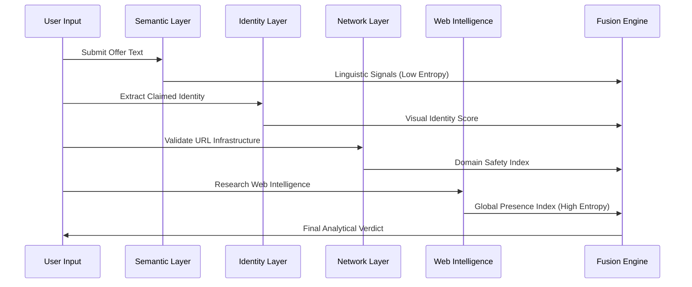

# VeriIntern AI: Technical & Theoretical Specification

## Abstract
VeriIntern AI is a multi-layered analytical system designed to identify and flag fraudulent internship solicitations. By implementing a **Weighted Fusion Engine**, the system cross-references linguistic patterns, digital identity markers, and global knowledge-base records. This architecture ensures a prioritized verification process that values verified web-intelligence over self-contained text signals, mitigating the threat of internship-related fraud.

---

## Architectural Theory

### 1. Multi-Dimensional Defense-in-Depth
The system operates on an isolating layered model where each computational layer performs a specific validation specialized in a single data dimension. This prevents a single failure point—such as a convincing but fake company name—from compromising the entire verdict.



### 2. Weighted Information Fusion Logic
VeriIntern AI utilizes a prioritized weighting system. We acknowledge that text-based signals (e.g., "Registration Fee") are informative but easily manipulated by scammers. Therefore, the system assigns the highest weight (55%) to **External Knowledge Verification**, ensuring that an organization's global footprint is the primary driver of legitimacy.

---

## Technological Stack Evaluation

Each tool in our stack was selected based on technical performance, library ecosystem, and security requirements:

- **Python 3.10+**: Utilized for text processing (regex), data manipulation, and implementing the conditional scoring logic.
- **Flask (Micro-framework)**: Serves as the web orchestration layer, delivering JSON data between the analytical backend and the user dashboard.
- **MediaWiki Global API**: Used to query the Wikipedia database in real-time to verify the existence and legitimacy of claimed organizations.
- **Vanilla CSS3 & ES6 JavaScript**: Powers the zero-dependency frontend dashboard, handling real-time UI updates and result rendering.

---

## Core Security Mechanics

### I. Homoglyph Visual Normalization
Fraudulent actors often use visually similar characters (Homoglyphs) to impersonate reputable companies (e.g., using 'rn' instead of 'm'). VeriIntern AI neutralizes this through a **Normalization Engine** that resolves ambiguous characters to their standard form before verification.

### II. Semantic Contradiction Logic
The system identifies logic gaps in offers. For example, if a verified organization (like "Google") is extracted from a text that simultaneously demands a "Registration Fee," the system triggers a **Scam Override**, as these two signals are operationally inconsistent in legitimate hiring.

---

## Exhaustive Project Structure

VeriIntern AI is engineered with a strict modular hierarchy to ensure maintainability and security isolation:

```text
VeriIntern-AI/
├── .gitignore                # Git Configuration: Defines system exclusion rules
├── app.py                    # Analytical Orchestrator: Core API and Fusion Logic
├── Readme.md                 # Technical Specification: System documentation
├── requirements.txt          # Dependency Manifest: List of requisite libraries
├── test_scoring.py           # Verification Suite: Automated logic validation scripts
│
├── utils/                    # Theoretical Core: Specialized analysis modules
│   ├── __init__.py           # Package Descriptor: Defines the directory as a module
│   ├── company_check.py      # Identity Engine: Implements Homoglyph normalization
│   ├── scraping_agent.py     # Intelligence Agent: Wikipedia research logic
│   └── url_check.py          # Network Logic: URL infrastructure analysis
│
├── templates/                # Presentation Layer: Structural layout
│   └── index.html            # Analytical Dashboard: System interface
│
└── static/                   # Asset Management: Visual and logical assets
    ├── favicon.svg           # Identity Asset: System brand mark
    ├── script.js             # Client Logic: UI orchestration and API bridging
    └── style.css             # Visual Directives: Premium design patterns
```

---

## Deployment & Implementation Guide

### Prerequisites
- Python 3.10 or higher
- Pip Package Manager

### System Initialization
1.  **Environment Preparation**:
    ```bash
    python -m venv venv
    source venv/bin/activate  # venv\Scripts\activate on Windows
    ```
2.  **Library Installation**:
    ```bash
    pip install -r requirements.txt
    ```
3.  **Engine Execution**:
    ```bash
    python app.py
    ```

---

## Project Leadership & Governance

The technical architecture and development of VeriIntern AI are spearheaded by:

- **Mano Shruthi S**
- **Bala Sowndarya B**
- **Kowsalya V**
- **Kaviya Varshini S**

---
VeriIntern AI - Internship Fraud Detection System
