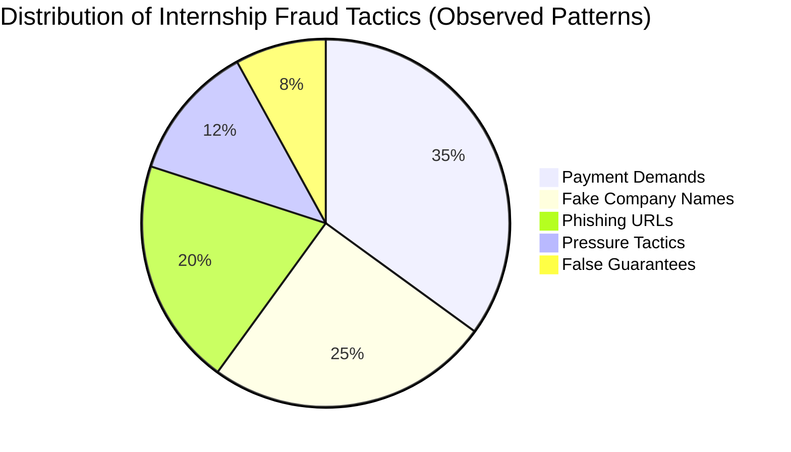
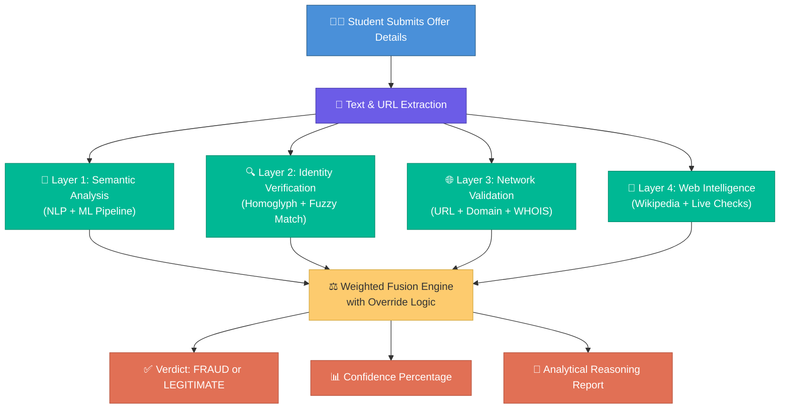
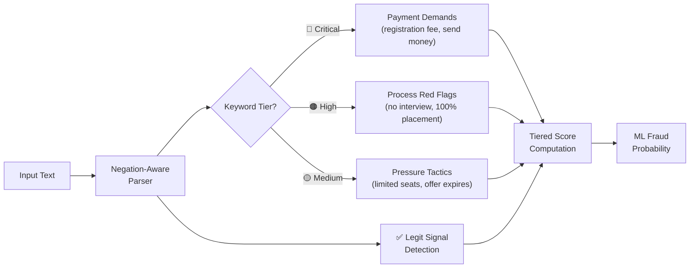
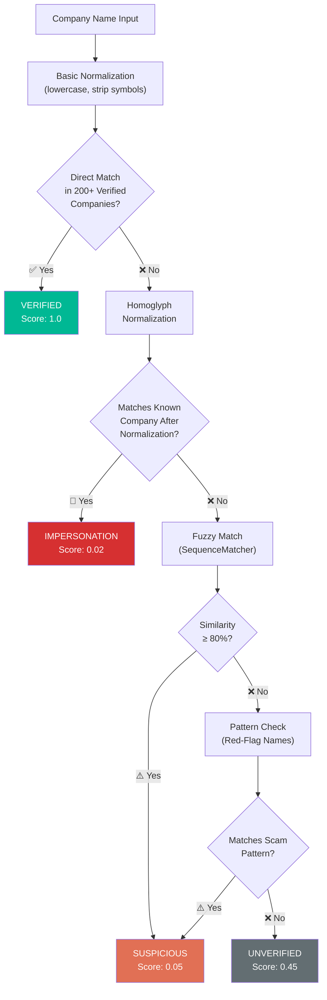
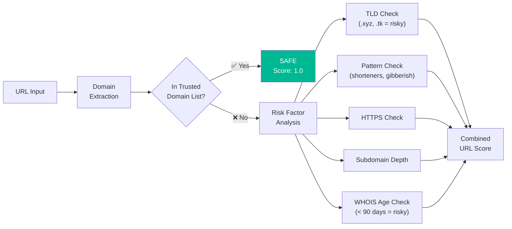
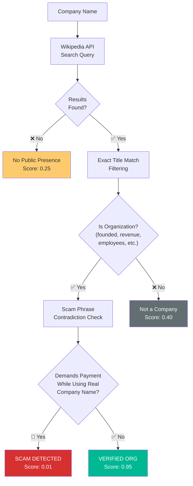
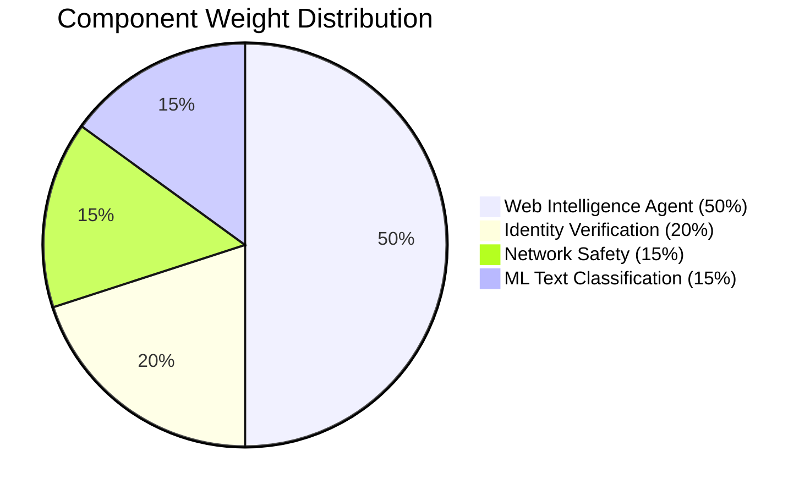
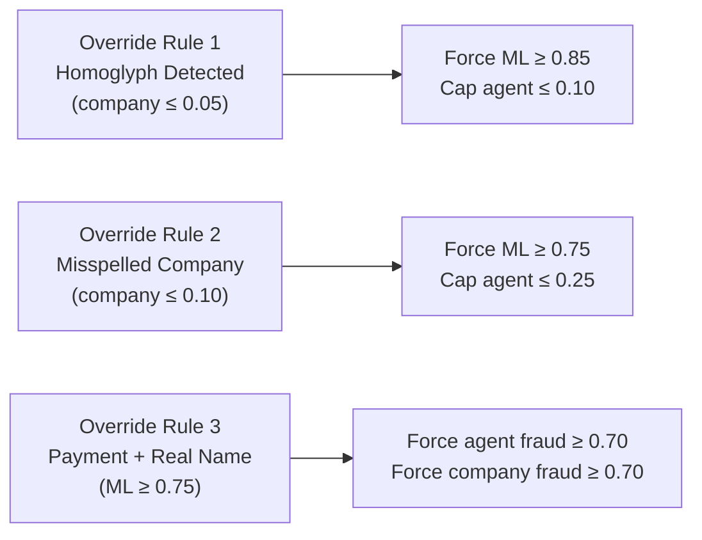
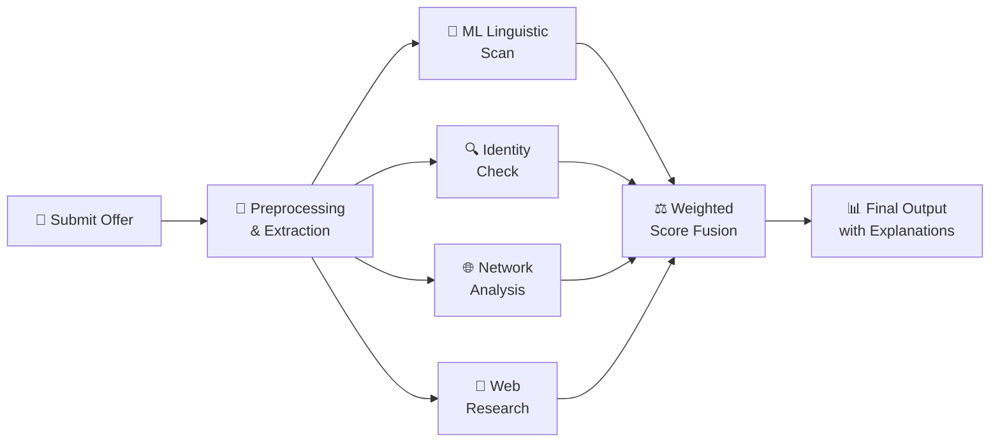
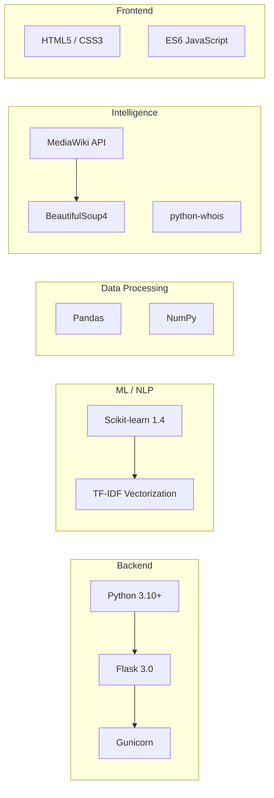

<](https://python.org)
[](https://flask.palletsprojects.com)
[](https://scikit-learn.org)
[]()
[]()

**A multi-layer AI-powered system that protects students from fraudulent internship offers by combining NLP text analysis, corporate identity verification, URL safety checks, and real-time web intelligence.**

---

</div>

## 📋 Table of Contents

- [Problem Statement](#-problem-statement)
- [Objective](#-objective)
- [System Architecture](#-system-architecture)
- [Core Detection Layers](#-core-detection-layers)
- [Weighted Decision Fusion](#-weighted-decision-fusion)
- [System Workflow](#-system-workflow)
- [Detection Scenarios](#-detection-scenarios)
- [Tech Stack](#-tech-stack)
- [Project Structure](#-project-structure)
- [Features](#-features)
- [Installation & Usage](#-installation--usage)
- [Testing & Validation](#-testing--validation)
- [Team](#-team)
- [Conclusion](#-conclusion)

---

## 🔍 Problem Statement

Students frequently encounter fraudulent internship solicitations that involve:

- 💰 **Unauthorized payment requests** — "registration fees", "security deposits", "processing fees"
- 🎭 **Deceptive company identities** — visual character tricks like `rnicrosoft` mimicking `microsoft`
- 🔗 **Suspicious or phishing URLs** — domains with risky TLDs, URL shorteners, gibberish hostnames
- ⏰ **Pressure tactics** — "offer expires tonight", "limited seats", "confirm your seat now"

Standard detection methods rely solely on keyword matching, which fails against sophisticated impersonation. VeriIntern AI addresses this gap with a **multi-layer fusion approach** that cross-references global knowledge bases and security markers.


```mermaid
pie title Distribution of Internship Fraud Tactics (Observed Patterns)
    "Payment Demands" : 35
    "Fake Company Names" : 25
    "Phishing URLs" : 20
    "Pressure Tactics" : 12
    "False Guarantees" : 8
```

---

## 🎯 Objective

- Develop a **multi-source analytical framework** for fraud detection
- Integrate **ML-based linguistic predictions** with external intelligence checks
- Implement **homoglyph and impersonation neutralization** for visual character tricks
- Provide a **clear verdict, confidence score, and detailed explanation report**
- Deliver a **production-ready web application** with a premium analytical dashboard

---

## 🏗️ System Architecture


```mermaid
flowchart TD
    A["🧑‍🎓 Student Submits Offer Details"]:::input --> B["📄 Text & URL Extraction"]:::process

    B --> C1["🧠 Layer 1: Semantic Analysis<br/>(NLP + ML Pipeline)"]:::layer
    B --> C2["🔍 Layer 2: Identity Verification<br/>(Homoglyph + Fuzzy Match)"]:::layer
    B --> C3["🌐 Layer 3: Network Validation<br/>(URL + Domain + WHOIS)"]:::layer
    B --> C4["📡 Layer 4: Web Intelligence<br/>(Wikipedia + Live Checks)"]:::layer

    C1 --> D["⚖️ Weighted Fusion Engine<br/>with Override Logic"]:::fusion
    C2 --> D
    C3 --> D
    C4 --> D

    D --> E["✅ Verdict: FRAUD or LEGITIMATE"]:::output
    D --> F["📊 Confidence Percentage"]:::output
    D --> G["📝 Analytical Reasoning Report"]:::output

    classDef input fill:#4A90D9,stroke:#2C5F8A,color:#fff
    classDef process fill:#6C5CE7,stroke:#4A3DB0,color:#fff
    classDef layer fill:#00B894,stroke:#008E6F,color:#fff
    classDef fusion fill:#FDCB6E,stroke:#D4A940,color:#333
    classDef output fill:#E17055,stroke:#B8543F,color:#fff
```

---

## 🧠 Core Detection Layers

### Layer 1: Linguistic Signal Analysis (NLP/ML)

The text analysis engine uses a **tiered keyword scoring system** with negation-aware detection to evaluate offer language.


```mermaid
flowchart LR
    A["Input Text"] --> B["Negation-Aware<br/>Parser"]
    B --> C{"Keyword Tier?"}
    C -->|"🔴 Critical"| D["Payment Demands<br/>(registration fee, send money)"]
    C -->|"🟠 High"| E["Process Red Flags<br/>(no interview, 100% placement)"]
    C -->|"🟡 Medium"| F["Pressure Tactics<br/>(limited seats, offer expires)"]
    B --> G["✅ Legit Signal<br/>Detection"]
    D --> H["Tiered Score<br/>Computation"]
    E --> H
    F --> H
    G --> H
    H --> I["ML Fraud<br/>Probability"]
```

**Keyword Tier Scoring:**

| Tier | Keywords | Score Impact | Example |
|:---|:---|:---|:---|
| 🔴 Critical | 13 payment-demand phrases | +0.50 to +0.90 | `registration fee`, `pay now`, `send money` |
| 🟠 High | 7 process red-flag phrases | +0.20 to +0.30 | `no interview required`, `instant offer letter` |
| 🟡 Medium | 6 pressure-tactic phrases | +0.06 to +0.20 | `limited seats`, `offer expires`, `guaranteed certificate` |
| 🟢 Legit Signals | 16 legitimate process indicators | -20% to -60% | `interview process`, `coding round`, `screening process` |

**Negation Awareness:** The system distinguishes between `"Pay registration fee"` (fraud) and `"No registration fee"` (legitimate) by scanning a 25-character prefix window for negation words like `no`, `not`, `without`, `never`, `don't`.

---

### Layer 2: Identity Verification

Multi-stage corporate identity validation protecting against impersonation attacks.


```mermaid
flowchart TD
    A["Company Name Input"] --> B["Basic Normalization<br/>(lowercase, strip symbols)"]
    B --> C{"Direct Match<br/>in 200+ Verified<br/>Companies?"}
    C -->|"✅ Yes"| D["VERIFIED<br/>Score: 1.0"]:::verified
    C -->|"❌ No"| E["Homoglyph<br/>Normalization"]
    E --> F{"Matches Known<br/>Company After<br/>Normalization?"}
    F -->|"🚨 Yes"| G["IMPERSONATION<br/>Score: 0.02"]:::fraud
    F -->|"❌ No"| H["Fuzzy Match<br/>(SequenceMatcher)"]
    H --> I{"Similarity<br/> ≥ 80%?"}
    I -->|"⚠️ Yes"| J["SUSPICIOUS<br/>Score: 0.05"]:::suspicious
    I -->|"❌ No"| K["Pattern Check<br/>(Red-Flag Names)"]
    K --> L{"Matches Scam<br/>Pattern?"}
    L -->|"⚠️ Yes"| J
    L -->|"❌ No"| M["UNVERIFIED<br/>Score: 0.45"]:::unknown

    classDef verified fill:#00B894,color:#fff
    classDef fraud fill:#D63031,color:#fff
    classDef suspicious fill:#E17055,color:#fff
    classDef unknown fill:#636E72,color:#fff
```

**Homoglyph Detection Map:**

| Visual Trick | Fake Character | Real Character | Example |
|:---|:---|:---|:---|
| `rn` → `m` | rn | m | `rnicrosoft` → `microsoft` |
| `vv` → `w` | vv | w | `vvipro` → `wipro` |
| `0` → `o` | 0 (zero) | o | `g00gle` → `google` |
| `1` → `l` | 1 (one) | l | `1inkedin` → `linkedin` |
| `$` → `s` | $ | s | `micro$oft` → `microsoft` |
| `@` → `a` | @ | a | `@mazon` → `amazon` |
| `3` → `e` | 3 | e | `d3loitte` → `deloitte` |

---

### Layer 3: Infrastructure & URL Safety

Automated domain analysis with multi-signal risk assessment.


```mermaid
flowchart LR
    A["URL Input"] --> B["Domain<br/>Extraction"]
    B --> C{"In Trusted<br/>Domain List?"}
    C -->|"✅ Yes"| D["SAFE<br/>Score: 1.0"]:::safe
    C -->|"❌ No"| E["Risk Factor<br/>Analysis"]
    E --> F["TLD Check<br/>(.xyz, .tk = risky)"]
    E --> G["Pattern Check<br/>(shorteners, gibberish)"]
    E --> H["HTTPS Check"]
    E --> I["Subdomain Depth"]
    E --> J["WHOIS Age Check<br/>(< 90 days = risky)"]
    F --> K["Combined<br/>URL Score"]
    G --> K
    H --> K
    I --> K
    J --> K

    classDef safe fill:#00B894,color:#fff
```

**Risk Deduction Table:**

| Risk Factor | Score Penalty | Indicator |
|:---|:---|:---|
| Suspicious TLD (`.xyz`, `.tk`, `.gq`) | -0.25 | Free/spam-associated domains |
| Suspicious Pattern (shorteners, gibberish) | -0.20 | URL obfuscation attempt |
| Multiple Hyphens (≥ 2) | -0.15 | Phishing domain structure |
| No HTTPS | -0.10 | Missing encryption |
| Excessive Subdomains (> 4 levels) | -0.10 | Complex redirect chains |
| Very New Domain (< 90 days) | -0.20 | Recently registered |

---

### Layer 4: Web Intelligence Agent

Real-time web verification using Wikipedia's MediaWiki API with contradiction detection.


```mermaid
flowchart TD
    A["Company Name"] --> B["Wikipedia API<br/>Search Query"]
    B --> C{"Results<br/>Found?"}
    C -->|"❌ No"| D["No Public Presence<br/>Score: 0.25"]:::warn
    C -->|"✅ Yes"| E["Exact Title Match<br/>Filtering"]
    E --> F{"Is Organization?<br/>(founded, revenue,<br/>employees, etc.)"}
    F -->|"✅ Yes"| G["Scam Phrase<br/>Contradiction Check"]
    F -->|"❌ No"| H["Not a Company<br/>Score: 0.40"]:::neutral
    G --> I{"Demands Payment<br/>While Using Real<br/>Company Name?"}
    I -->|"🚨 Yes"| J["SCAM DETECTED<br/>Score: 0.01"]:::fraud
    I -->|"✅ No"| K["VERIFIED ORG<br/>Score: 0.95"]:::safe

    classDef warn fill:#FDCB6E,color:#333
    classDef neutral fill:#636E72,color:#fff
    classDef fraud fill:#D63031,color:#fff
    classDef safe fill:#00B894,color:#fff
```

---

## ⚖️ Weighted Decision Fusion

The fusion engine combines all four layers using a **priority-weighted system** where the Web Intelligence Agent serves as the primary signal driver.


```mermaid
pie title Component Weight Distribution
    "Web Intelligence Agent (50%)" : 50
    "Identity Verification (20%)" : 20
    "Network Safety (15%)" : 15
    "ML Text Classification (15%)" : 15
```

| Component | Weight | Role |
|:---|:---|:---|
| 🌐 Web Intelligence Agent | **50%** | Primary signal — validates global corporate footprint |
| 🔍 Identity Verification | **20%** | Detects impersonation, homoglyphs, and name tricks |
| 🔗 Network Safety | **15%** | Evaluates URL, domain, TLD, and WHOIS data |
| 🧠 ML Text Classification | **15%** | Identifies linguistic fraud patterns in offer text |

### Override Rules

The system includes critical override logic for high-confidence scenarios:


```mermaid
flowchart LR
    A["Override Rule 1<br/>Homoglyph Detected<br/>(company ≤ 0.05)"] --> B["Force ML ≥ 0.85<br/>Cap agent ≤ 0.10"]
    C["Override Rule 2<br/>Misspelled Company<br/>(company ≤ 0.10)"] --> D["Force ML ≥ 0.75<br/>Cap agent ≤ 0.25"]
    E["Override Rule 3<br/>Payment + Real Name<br/>(ML ≥ 0.75)"] --> F["Force agent fraud ≥ 0.70<br/>Force company fraud ≥ 0.70"]
```

---

## 🔄 System Workflow


```mermaid
flowchart LR
    A["📝 Submit Offer"] --> B["🔧 Preprocessing<br/>& Extraction"]
    B --> C["🧠 ML Linguistic<br/>Scan"]
    B --> D["🔍 Identity<br/>Check"]
    B --> E["🌐 Network<br/>Analysis"]
    B --> F["📡 Web<br/>Research"]
    C --> G["⚖️ Weighted<br/>Score Fusion"]
    D --> G
    E --> G
    F --> G
    G --> H["📊 Final Output<br/>with Explanations"]
```

---

## 🧪 Detection Scenarios

Example scenarios demonstrating the system's detection capabilities:

| Scenario | ML Score | Company | URL | Agent | Verdict |
|:---|:---|:---|:---|:---|:---|
| Real company, legitimate offer | 0.00 | ✅ Verified (1.0) | ✅ Safe (1.0) | ✅ Confirmed (0.95) | **LEGITIMATE** ✅ |
| Fake company, payment demands | 0.90 | ❓ Unknown (0.45) | ⚠️ Risky (0.35) | ❌ Not found (0.25) | **FRAUD** 🚨 |
| Real name + payment demand | 0.75 | ✅ Verified (1.0) | ✅ Safe (1.0) | 🚨 Override (0.01) | **FRAUD** 🚨 |
| Homoglyph impersonation (`rnicrosoft`) | 0.85+ | 🚨 Impersonation (0.02) | ⚠️ Unknown (0.60) | ❌ Override (0.10) | **FRAUD** 🚨 |
| Unknown company, clean language | 0.00 | ❓ Unverified (0.45) | — No URL | ❓ Mixed (0.50) | **LEGITIMATE** ✅ |

---

## 💻 Tech Stack


```mermaid
graph LR
    subgraph Backend
        A["Python 3.10+"]
        B["Flask 3.0"]
        C["Gunicorn"]
    end
    subgraph ML_NLP["ML / NLP"]
        D["Scikit-learn 1.4"]
        E["TF-IDF Vectorization"]
    end
    subgraph Data["Data Processing"]
        F["Pandas"]
        G["NumPy"]
    end
    subgraph Intelligence
        H["MediaWiki API"]
        I["BeautifulSoup4"]
        J["python-whois"]
    end
    subgraph Frontend
        K["HTML5 / CSS3"]
        L["ES6 JavaScript"]
    end

    A --> B
    B --> C
    D --> E
    H --> I
```

| Layer | Technology |
|:---|:---|
| **Language** | Python 3.10+ |
| **ML / NLP** | Scikit-learn 1.4, TF-IDF Vectorization |
| **Data Processing** | Pandas 2.2, NumPy 1.26 |
| **Backend Framework** | Flask 3.0, Gunicorn |
| **Frontend** | HTML5, CSS3, ES6 JavaScript |
| **Intelligence Source** | MediaWiki API (Wikipedia) |
| **Web Scraping** | BeautifulSoup4, Requests |
| **Network Analysis** | python-whois, urllib |
| **Deployment** | Render (via Procfile) |

---

## 📁 Project Structure

```
VeriIntern-AI/
│
├── 📄 app.py                    # Core API server, fusion engine, ML scoring logic
├── 📄 test_scoring.py           # Automated test suite for scoring validation
├── 📄 requirements.txt          # Python dependency manifest (28 packages)
├── 📄 Procfile                  # Deployment config for Gunicorn
├── 📄 runtime.txt               # Python runtime specification
├── 📄 .gitignore                # Git exclusion rules
│
├── 📂 utils/                    # Specialized analysis modules
│   ├── __init__.py              # Package initializer
│   ├── company_check.py         # Identity engine: 200+ companies, homoglyph detection
│   ├── scraping_agent.py        # Web intelligence agent: Wikipedia + URL liveness
│   └── url_check.py             # URL safety: TLD, WHOIS, pattern analysis
│
├── 📂 templates/
│   └── index.html               # Premium analytical dashboard (IBM Plex typography)
│
└── 📂 static/
    ├── style.css                # Glassmorphism dark-mode design system
    ├── script.js                # Client-side orchestration and API bridge
    └── favicon.svg              # Brand identity mark (shield icon)
```

---

## ✨ Features

- 🔬 **4-Layer Prioritized Fraud Detection** — ML, identity, network, and web intelligence
- 🧠 **ML Pipeline with TF-IDF** — Scikit-learn powered text classification
- 🎭 **Homoglyph Impersonation Detection** — Catches `rnicrosoft`, `g00gle`, `vvipro`, etc.
- 🔍 **Negation-Aware Keyword Matching** — Distinguishes "pay fee" from "no fee"
- 📡 **Real-Time Web Intelligence** — Live Wikipedia verification via MediaWiki API
- 🌐 **URL & Domain Risk Analysis** — TLD checks, WHOIS age, pattern detection
- ⚖️ **Weighted Fusion with Override Logic** — Priority-based scoring with hard overrides
- 🖥️ **Premium Analytical Dashboard** — Dark glassmorphism UI with IBM Plex typography
- 📊 **Detailed Reasoning Reports** — Full transparency on every detection decision
- 🧪 **Comprehensive Test Suite** — Automated validation for homoglyphs, negation, and scoring

---

## 🚀 Installation & Usage

### Prerequisites

- Python 3.10 or higher
- pip package manager

### Setup

```bash
# Clone the repository
git clone https://github.com/your-username/VeriIntern-AI.git
cd VeriIntern-AI

# Create virtual environment
python -m venv venv
venv\Scripts\activate        # Windows
# source venv/bin/activate   # Linux/Mac

# Install dependencies
pip install -r requirements.txt

# Run the application
python app.py
```

The application will be available at `http://localhost:5000`

### API Endpoint

```bash
POST /analyze
Content-Type: application/json

{
    "offer_text": "Congratulations! Pay Rs.999 registration fee for Google internship.",
    "company_name": "Google",
    "url": "https://example.com",
    "skip_scraping": false
}
```

**Response:**
```json
{
    "verdict": "FRAUD",
    "is_fraud": true,
    "confidence_percent": 92.5,
    "component_scores": {
        "ml_fraud_probability": 0.75,
        "agent_legitimacy": 0.01,
        "company_legitimacy": 1.0,
        "url_safety": 0.6
    },
    "explanations": ["..."]
}
```

---

## 🧪 Testing & Validation

Run the automated test suite:

```bash
python test_scoring.py
```

The test suite validates:

| Test Category | Tests | What It Validates |
|:---|:---|:---|
| Homoglyph Detection | 7 cases | `rnicrosoft`, `g00gle`, `vvipro`, `1nfosys`, `micro$oft`, `d3loitte`, `@mazon` |
| Fuzzy Impersonation | 2 cases | Typo-based impersonation (`Gogle`, `Microsft`) |
| Verified Companies | 3 cases | Correct recognition of real companies |
| Negation Awareness | 7 cases | Distinguishing fraud vs. negated keywords |
| ML Scoring | 4 cases | End-to-end fraud probability computation |

---

## 👥 Team

<div align="center">

| Role | Name | Responsibility |
|:---|:---|:---|
| 👑 **Team Leader** | **Bala Sowndarya B** | Project leadership, coordination, and strategic direction |
| 💻 **Developer** | **Mano Shruthi S** | Full-stack development, ML pipeline, system architecture |
| 📊 **Data Analyst** | **Kaviya Varshini S** | Data analysis, scoring validation, and performance metrics |
| 🎤 **Presenter** | **Kowsalya V** | Project presentation, documentation, and demonstration |

</div>

---

## 📌 Conclusion

VeriIntern AI provides a comprehensive and scalable analytical solution for neutralizing the threat of internship fraud. By fusing linguistic patterns with real-world web intelligence across four specialized detection layers, the system achieves high detection accuracy while minimizing false positives. The weighted fusion engine with override logic ensures that even sophisticated attacks — including homoglyph impersonation and payment-demanding scams using real company names — are reliably detected.

This system creates a reliable and trustworthy environment for students navigating online career opportunities.

---

<div align="center">

**VeriIntern AI** — Internship Authenticity Detection System

© 2026 | Academic Project Submission

</div>
]]>
